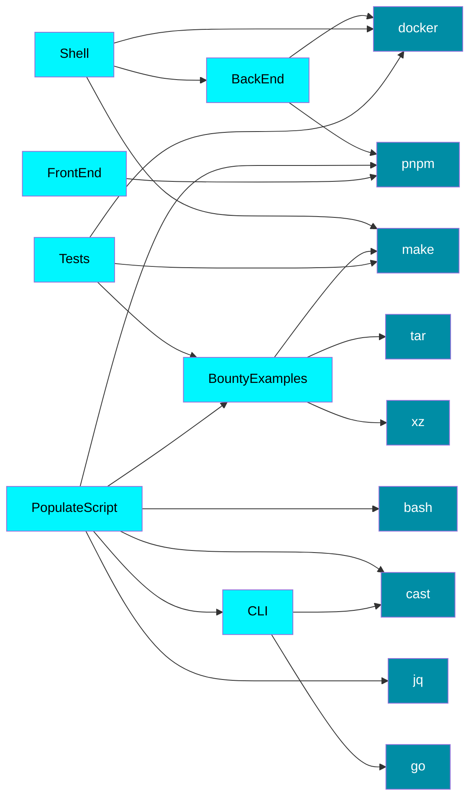

## Dependencies

For your purposes, not all dependencies may be required.
To help you figure out which dependencies you actually need, here is a tree of dependencies for each part of the code base.

